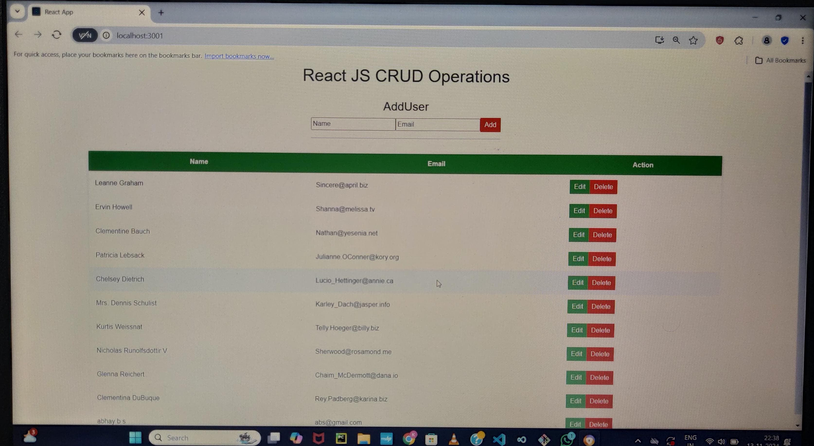

# React CRUD Application
This is a simple React application demonstrating basic **CRUD operations** (Create, Read, Update, Delete) for managing user information. Users can be added, viewed in a list, edited, and deleted. The app fetches initial data from an API and updates the user list in real time.

## Features

- **View Users**: Display a list of users with name and email.
- **Add User**: Fill in a form to add a new user to the list.
- **Edit User**: Modify an existing user’s name or email.
- **Delete User**: Remove a user from the list.

## Technologies Used

- **React**: For the UI and component structure.
- **React Hooks** (`useState`, `useEffect`): To manage component state and side effects.
- **Fetch API**: For data retrieval and manipulation.
